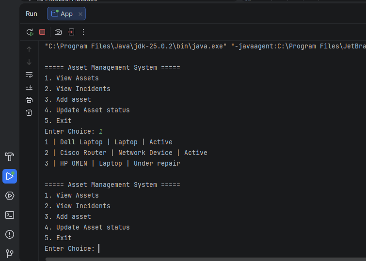
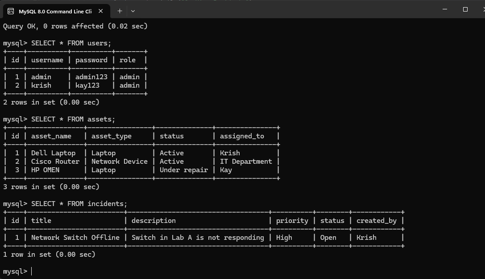

# Enterprise Asset & Incident Management System

A Java + MySQL + JDBC based application for managing enterprise assets and incident records.

## Features

- User Authentication
- Asset Management
- Asset Search
- Asset Status Updates
- Incident Creation
- Incident Tracking

## Technologies Used

- Java
- MySQL
- JDBC
- Git
- GitHub

## Screenshots

### Main Menu

### Database Records

## Author

Krish Chauhan